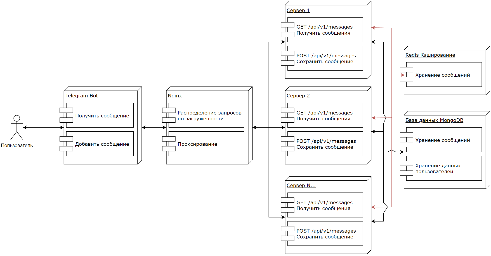

# Приложение бот мессенджер

Это приложение предназначено для получения сообщений от пользователей в общий набор сообщений и отображение этих сообщений при запросе пользователя.

Для общения и взаимодействия с пользователями используется Telegram бот, бот способен принимать сообщения от пользователей и отображать сообщения, полученные от всех пользователей в виде пагинации и ограниченного для одной станицы количества сообщений.

Для работы с сообщениями со стороны бота используется сервер с базой данных для хранения всех сообщений и информации о пользователях, приславших это сообщение, так же используется кеширование всех сообщений для быстрого доступа к ним.

# Быстрый старт

1. Скачайте и распакуйте архив.
2. В папке Docker выполните одну из следующих команд:
   1. В случае если вы используете разные .env файлы (mongo.env, bot.env, redis.env, server.env) для конфигурации docker-compose.
      `docker compose --env-file mongo.env --env-file bot.env --env-file redis.env --env-file server.env -f "docker-compose.yaml" up -d --build`
   2. В случае если вы используете один .env файл для конфигурации docker-compose.
      `docker compose -f "docker-compose.yaml" up -d --build`
3. После запуска, точкой доступа к серверу будет http://localhost:8000/ .

# API

Для доступа к документации FastApi используется точка доступа http://localhost:8000/docs# .

| Метод | Точки доступа    | Описание                                                                |
| ----- | ---------------- | ----------------------------------------------------------------------- |
| GET   | /api/v1/messages | Возвращает список всех сообщений пользователей хранящихся в базе данных |
| POST  | /api/v1/message  | Получает сообщение с данными пользователя для сохранения в базе данных  |

###### **GET /api/v1/messages**

Параметры:

| Имя             | Описание                                                                                                                                                             |
| --------------- | -------------------------------------------------------------------------------------------------------------------------------------------------------------------- |
| start (integer) | Стартовая позиция для получения сообщений. По умолчанию равен 0.                                                                                                     |
| range (integer) | Количество сообщений для получения начиная со стартовой позиции. По умолчанию равен 0, если меньше 1 возвращает все имеющиеся сообщения начиная со стартовой позиции |

Возвращает:

```json
{
  "messages": [
    // Список сообщений в обратно порядке получения на сервере
    {
      "user": "string", // Имя пользователя приславшего сообщение
      "timestamp": "string", // Время создания сообщения
      "message": "string" // Сообщение пользователя
    }
  ],
  "total_count": 0 // Общее число сообщений хранящееся в базе данных
}
```

###### **POST /api/v1/message**

Тело запроса:

```json
{
  "user": {
    // Данные пользователя приславшего сообщения
    "userId": "string", // ID пользователя Telegram (Обязательно)
    "first_name": "string", // Имя пользователя Telegram (Обязательно)
    "last_name": "string", // Фамилия пользователя Telegram
    "username": "string" // Имя аккаунта пользователя Telegram
  },
  "message": {
    // Сообщение пользователя
    "timestamp": "2024-11-13T10:24:17.581Z", // Время создания сообщения
    "message": "string" // Сообщение пользователя (Обязательно)
  }
}
```

Возвращает успешный ответ код 200.

# Переменные для Docker-Compose

#### **bot.env**

| Наименование | Описание                                    |
| ------------ | ------------------------------------------- |
| BOT_TOKEN    | Токен бота полученный от Telegram BotFather |
| SERVER_HOST  | Адрес к серверу обработчика сообщений       |

#### **mongo.env**

| Наименование               | Описание                                   |
| -------------------------- | ------------------------------------------ |
| MONGO_USER                 | Пользователь MongoDB                       |
| MONGO_PASSWORD             | Пароль пользователя MongoDB                |
| MONGO_PORT                 | Порт MongoDB                               |
| MONGO_EXPRESS_USER         | Пользователь системы Express               |
| MONGO_EXPRESS_PASSWORD     | Пароль пользователя системы Express        |
| MONGO_EXPRESS_WEB_USER     | Пользователь web интерфейса Express        |
| MONGO_EXPRESS_WEB_PASSWORD | Пароль пользователя web интерфейса Express |

#### **redis.env**

| Наименование   | Описание           |
| -------------- | ------------------ |
| REDIS_PORT     | Порт Redis         |
| REDIS_USER     | Пользователь Redis |
| REDIS_PASSWORD | Пароль Redis       |

#### **server.env**

| Наименование  | Описание                                         |
| ------------- | ------------------------------------------------ |
| MONGO_DB_HOST | Адрес MongoDB                                    |
| MONGO_DB_NAME | Название базы данных MongoDB для хранения данных |
| REDIS_HOST    | Адрес Redis                                      |

# Используемые инструменты

#### **Сервер**

Язык программирования: **Python**.
Библиотеки:

- fastapi - Веб-фреймворк для создания и документирования API.
- uvicorn - Веб-сервер на базе ASGI.
- pymongo - Дистрибутив для работы с MongoDB.
- redis - Дистрибутив для работы с Redis.
- py-automapper - Автоматическое сопоставление между объектами.

Хранение данных:

- MongoDB - NoSQL база данных
- Mongo Express - Веб-интерфейс для администрирования MongoDB
- Redis - In-memory база данных для кеширования:

Веб сервер для распределения нагрузки и проксирование запросов: Nginx

#### **Telegram Бот**

Язык программирования: **Python**.
Библиотеки:

- asyncio - Библиотека для написания параллельного кода с использованием синтаксиса async/await.
- aiogram - Асинхронная платформа для Telegram Bot API.
- requests - Библиотека HTTP запросов.
- py-automapper - Автоматическое сопоставление между объектами.

# Как это работает



#### Пользователь <---> Бот

Пользователь мессенджер платформы Telegram начинает общение с Messenger Bot командой _/start_.

Messenger Bot предлагает пользователю выбрать одну из функции "Получить сообщение" или "Добавить сообщение" с помощью встроенной клавиатуры.

В случае если пользователь выберет функцию "Добавить сообщение" бот предложит пользователю написать желаемое сообщение, которое попадет в общий набор сообщений всех пользователей.

В случае если пользователь выберет функцию "Получить сообщения" пользователю выведется список всех сообщений, разделенных пагинацией.

#### Бот <---> Сервер

В случае если пользователь выберет функцию "Добавить сообщение" и введет сообщение, то бот посредством HTTP запросит сервер сохранить данные в виде данных пользователя и данных сообщения по точке доступа **POST /api/v1/messages** с данными в теле запроса. В случае успешного выполнения запроса получит код ответа 200 и сообщит пользователю об успешном сохранении сообщения пользователя, в ином случае сообщит пользователю о том, что сообщение не удалось сохранить.

В случае если пользователь выберет функцию "Получить сообщения" то бот посредством HTTP запросит сервер выдать сообщения по точке доступа **GET /api/v1/messages** с параметрами в виде стартовой точки (start) и количества сообщений (range) в зависимости от текущей пагинации. В случае успешного выполнения запроса бот выведет полученные сообщения пользователю.

#### Сервер <---> Обработка

При обращении к серверу по точке доступа все запросы идут через проксирование Nginx и распределяются между подключёнными серверами посредством их загруженности в текущий момент.

В случае запроса на сервер по точке доступа **POST /api/v1/messages**, сервер проверит валидность полученных в запросе данных и в случае успешной валидации сохранит данные в базе данных MongoDB и очистит и после закеширует данные в базе данных Redis, после вернут на запрос код успешного выполнение 200, в ином случае вернет код ошибки вместе с сообщением ошибки.

В случае запроса на сервер по точке доступа **GET /api/v1/messages**, сервер по полученным параметрам или параметрам по умолчанию получит данные из кэша Redis или в случае если их там нет то запросит эти данные из базы данных mongoDB, после полученные данные вернут по запросу в теле запроса с кодом успешного выполнения 200, в ином случае вернет код ошибки вместе с сообщением ошибки.
